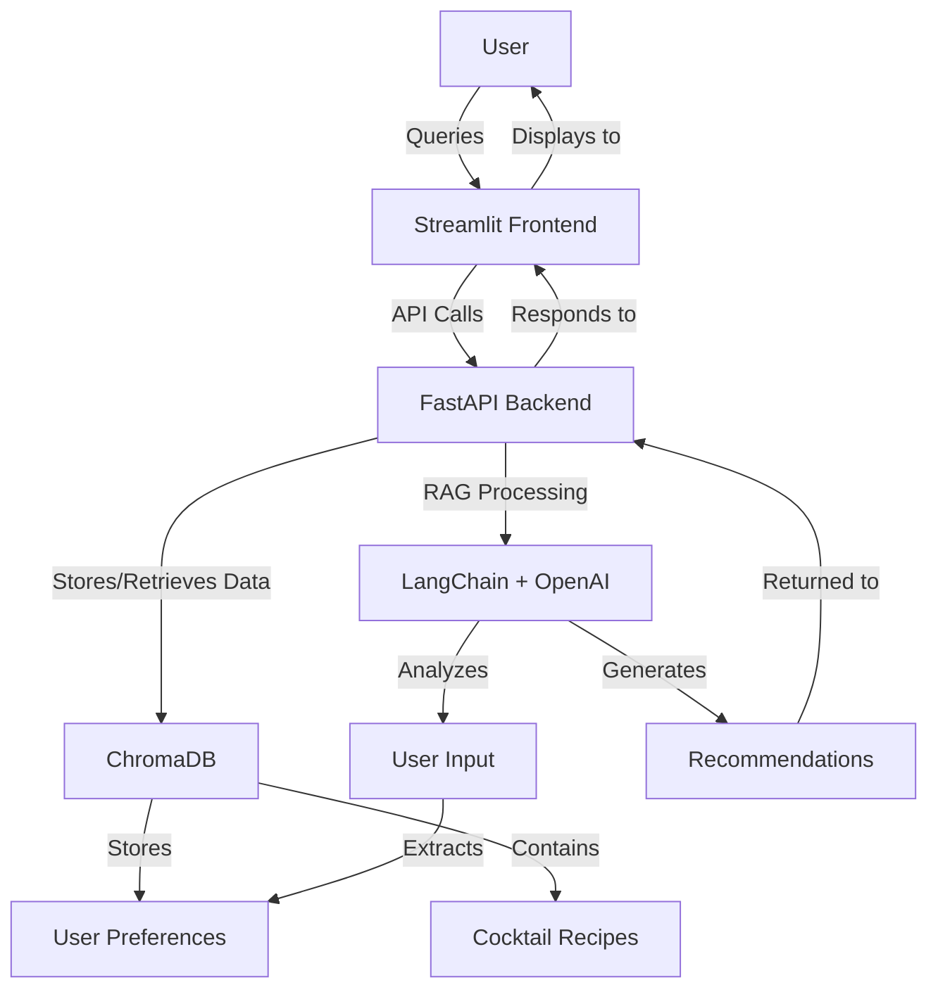

# Cocktail Advisor

## Description
A smart cocktail recommendation system that learns your preferences and suggests drinks based on your taste profile. The application uses natural language processing to detect user preferences from conversations and provides personalized cocktail recommendations.

## Features
- Natural language chat interface for cocktail inquiries | Interface de chat em linguagem natural para consultas sobre coquetéis
- Automatic detection of user preferences from conversation | Detecção automática de preferências do usuário a partir da conversa
- Personalized cocktail recommendations based on taste profile | Recomendações personalizadas de coquetéis com base no perfil de gosto
- Support for both alcoholic and non-alcoholic drinks | Suporte para bebidas alcoólicas e não alcoólicas
- Similar cocktail suggestions | Sugestões de coquetéis similares
- Preference tracking and management | Rastreamento e gerenciamento de preferências
- Detailed cocktail recipes and instructions | Receitas detalhadas de coquetéis e instruções

## Technologies Used
- **FastAPI**: Backend API framework | Framework de API para backend
- **Streamlit**: Frontend interface | Interface de frontend
- **LangChain**: Framework for RAG (Retrieval Augmented Generation) | Framework para RAG (Geração Aumentada por Recuperação)
- **ChromaDB**: Vector database for storing embeddings | Banco de dados vetorial para armazenar embeddings
- **OpenAI**: LLM provider for natural language understanding | Provedor de LLM para compreensão de linguagem natural
- **Python 3.9+**: Programming language | Linguagem de programação

## Project Structure | Estrutura do Projeto

```
cocktail-advisor/
├── chat.py                # Streamlit frontend 
├── main.py                # FastAPI backend 
├── rag_service.py         # RAG implementation 
├── vector_store_service.py # Vector database service 
├── cocktails.csv          # Dataset of cocktail recipes 
├── init_db.py             # Database initialization script 
├── requirements.txt       # Project dependencies 
└── database/              # ChromaDB storage directory
```

## Setup Instructions 

### Prerequisites
- Python 3.9 or higher
- pip (Python package installer)
- OpenAI API key

### Installation

1. Clone the repository
   ```bash
   git clone https://github.com/yourusername/cocktail-advisor.git
   cd cocktail-advisor
   ```
2. Created venv
   ```bash
   # On Windows 
    python -m venv venv
    venv\Scripts\activate
    
    # On macOS/Linux
    python3 -m venv venv
    source venv/bin/activate
   ```

3. Install dependencies
   ```bash
   pip install -r requirements.txt
   ```

4. In .env archive
   ```bash
   OPENAI_API_KEY=your_api_key_here  # Replace with the key provided by email | 
   ```

5. Initialize the database with cocktail data 
   ```bash
   python -m utils.initialize_db   
   ```

6. Start the FastAPI backend
   ```bash
   uvicorn api.main:app --reload
   ```

7. In a new terminal, start the Streamlit frontend
   ```bash
   streamlit run frontend/app.py
   ```

7. Open your browser and navigate to [http://localhost:8501](http://localhost:8501) to use the application.

## Architecture



## Usage

1. Start a conversation by asking about cocktails | Inicie uma conversa perguntando sobre coquetéis
2. The system will automatically detect your preferences as you chat | O sistema detectará automaticamente suas preferências enquanto você conversa
3. Ask for recommendations based on ingredients you like | Peça recomendações com base nos ingredientes que você gosta
4. View your stored preferences in the sidebar | Veja suas preferências armazenadas na barra lateral
5. Get detailed recipes and instructions for any cocktail | Obtenha receitas detalhadas e instruções para qualquer coquetel

## API Endpoints

- `POST /chat`: Send a message to the chatbot 
- `GET /preferences`: Get the current user preferences 
- `POST /test-preferences`: Test endpoint for preference detection

## Dataset

The application uses a dataset of 425 cocktail recipes with detailed information about ingredients, preparation methods, and categories.

## License | Licença
[MIT License](LICENSE)
